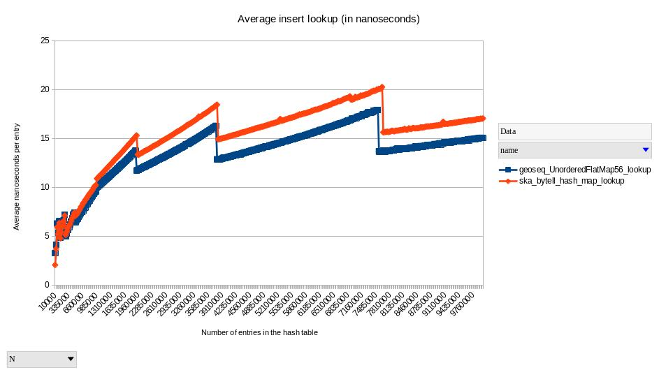
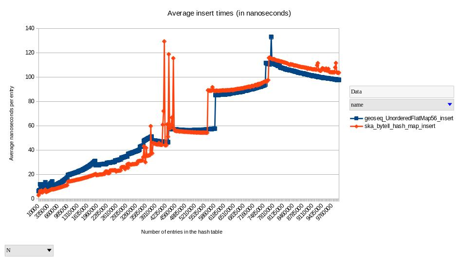

# geoseq_unordered_flatmap56

*geoseq_unordered_flatmap56* is a hash table that uses linear probing based on a geometric sequence of numbers. Its lookup times are faster than the [bytell](https://github.com/skarupke/flat_hash_map) hash table by [skarupke](https://github.com/skarupke). However, its key size is limited to 56 bits.

|Function|Description|
|--------|-----------|
|flatmap56_t* flatmap56_create(const uint64_t initial_capacity, const uint64_t value_size);|Allocates and initializes a flatmap56_t object on the heap.|
|void flatmap56_destroy(flatmap56_t* map);|Deallocates the instance of a flatmap56_t object pointed to by *map*.|
|float flatmap56_load_factor(const flatmap56_t* map);|Calcluates and returns the current load factor of the table.|
|uint64_t flatmap56_bucket_count(const flatmap56_t* map);|Returns the current number of buckets in the hash table.|
|uint64_t flatmap56_max_bucket_count(const flatmap56_t* map);|Returns the maximum number of buckets supported by this implementation.|
|uint64_t flatmap56_min_bucket_count();|Returns the minimum number of buckets supported by this implementation.|
|uint64_t flatmap56_size(const flatmap56_t* map);|Returns the current number of elements in the table.|
|void* flatmap56_lookup(const flatmap56_t* map, const uint64_t key);|Attempts to find the bucket in the hash table that is associated with key. Returns a pointer to the corresponding value if successful, otherwise NULL is returned upon failure.|
|void* flatmap56_insert(flatmap56_t* map, const uint64_t key);|Inserts a new key-value pair into the table. If the table already contains the key, then the current value is replaced with the new value. Regardless, a pointer to the value in the table is returned on success. Otherwise, NULL is returned on failure.|
|bool flatmap56_remove(flatmap56_t* map, const uint64_t key, void* value);|Removes the key-value pair associated with key. If the key exists in the table then the corresponding value is copied into the buffer before it is removed. Returns true if the key exists in the table, otherwise false is returned.|

## License

*geoseq_unordered_flatmap56* is licensed uner the Boost Software License - Version 1.0 - August 17th, 2003.

## Building and running the files

The included makefile will build two executables. The first is called *geoseq_test*, which is used for testing and debugging. The second is named geoseq_benchmark, which performs a benchmark against bytell. [Google Benchmark](https://github.com/google/benchmark) is required to compile, build and run *geoseq_benchmark*.

    $ cd geoseq_unordered_flatmap56
    $ make
    $ make clean
    $ ./geoseq_test
    $ ./geoseq_benchmark

You can also tell Google Benchmark to output its data in CSV format with the following command:

    $ ./geoseq_benchmark --benchmark_format=csv > test_results.csv

## Performance

